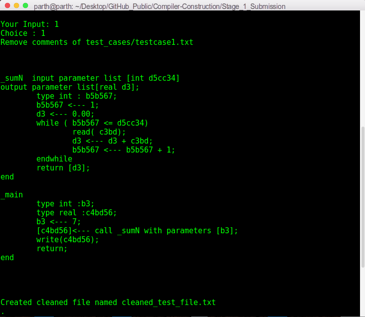

# Stage 1 Submission

This folder contains compiler code for custom language developed till Stage 1 of the project. The file description is as follows:

1. `First Sets.pdf`: It contains the first sets of all the non-terminals used in the grammar to describe syntax of the custom language.
2. `Follow Sets.pdf`: It contains the follow sets of all the non-terminals used in the grammar to describe syntax of the custom language.
3. `grammar.txt`: It contains the original grammar rules, as specified in the language specification document.
4. `lexer.c`, `lexer.h` and `lexerDef.h`: Code for the lexical analyzer module of the compiler.
5. `hashTable.c`, `hashTable.h` and `hashTableDef.h`: Implements a hash-table (that is used by the lexical analyzer module).
6. `stack.c`, `stack.h` and `stackDef.h`: Implements a stack (that is used by the parser module).
7. `NaryTree.c`, `NaryTree.h` and `NaryTreeDef.h`: Implements a N-ary tree (that can be used to represent the parse tree, in case the input source code is syntactically correct).
8. `parser.c`, `parser.h` and `parserDef.h`: Code for the parser (predictive parser) module of the compiler.

`driver.c` contains driver code that integrates all the above compiler functionalities. Run the following commands in the terminal to run a particular test-case (let's say `testcase1.txt`):
```sh
make
./stage1exe test_cases/testcase1.txt output.txt
```
where `output.txt` stores the parse tree (generated by option `3`, as specified below)

The driver presents the following five options (preferably, to be run sequentially):
  * `1`: Removes comments from code file and outputs the cleaned code to `cleaned_test_file.txt`.
  * `2`: Prints list of tokens generated by the lexer to console.
  * `3`: Prints to console whether the the input source code is syntactically correct or not, and prints the parse tree to `output.txt` in case input source code is syntactically correct.
  * `4`: Prints the time taken to find syntactic correctness.
  * `0`: Exit the interface.

The following is a screenshot of the terminal upon running the above commands:


Option 1:



Option 2:


Option 3:


Option 4:


