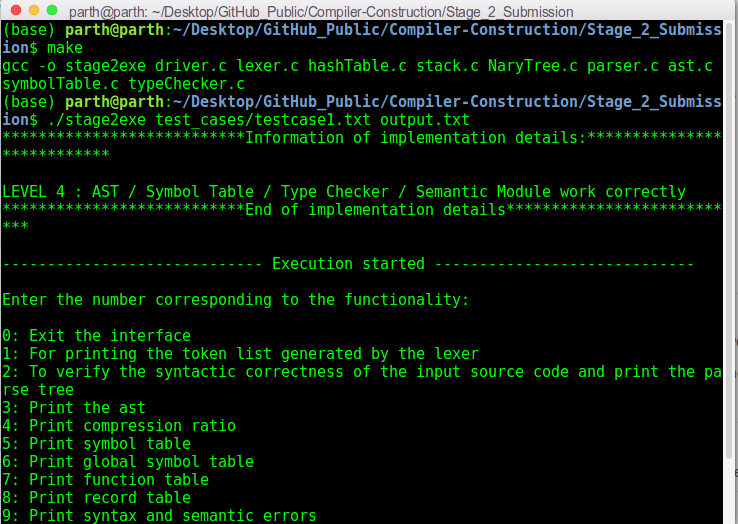
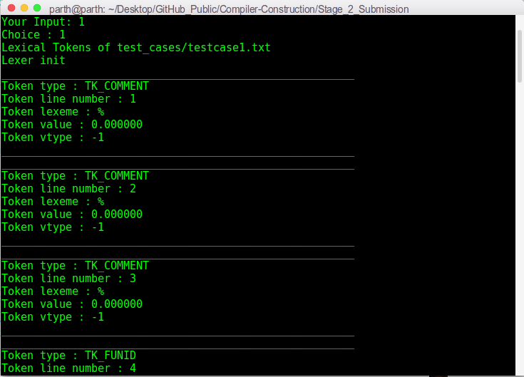
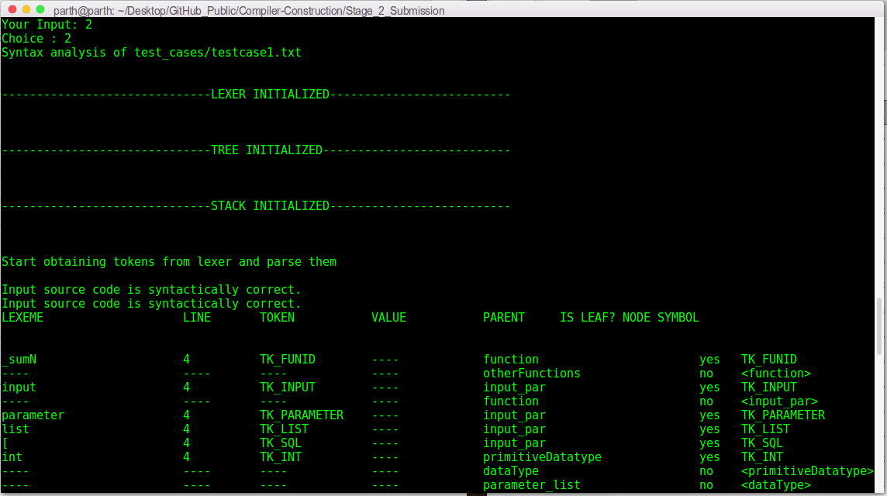
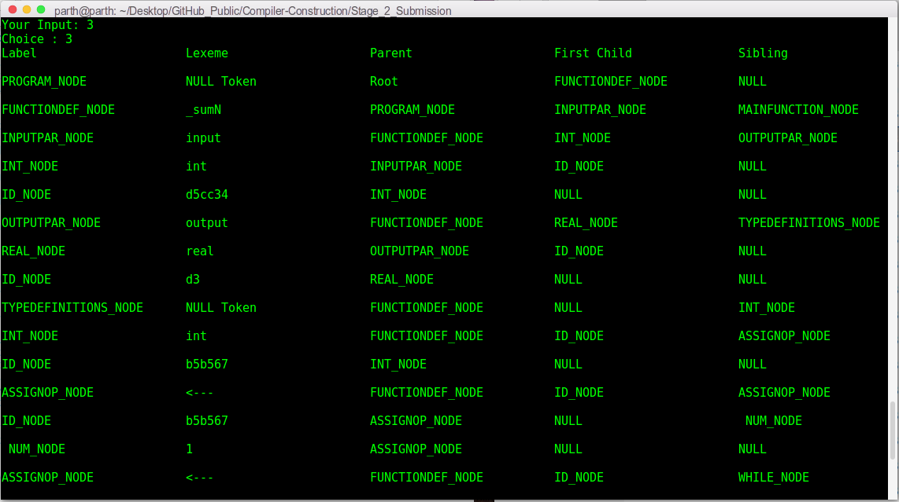
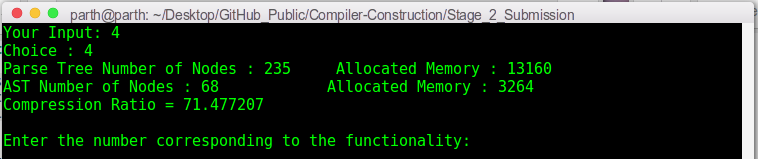
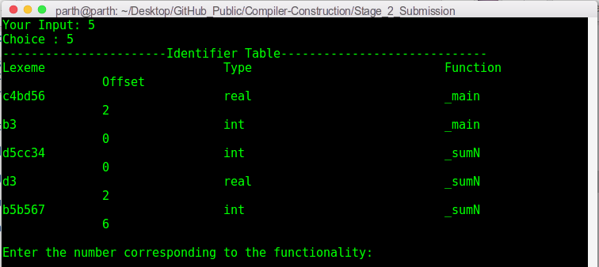
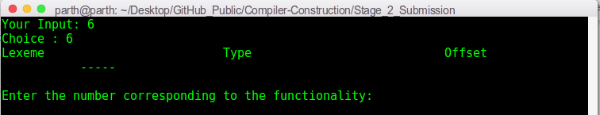
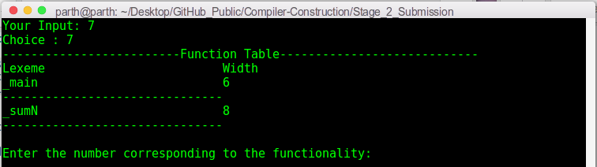
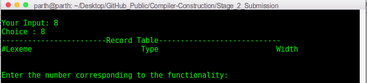
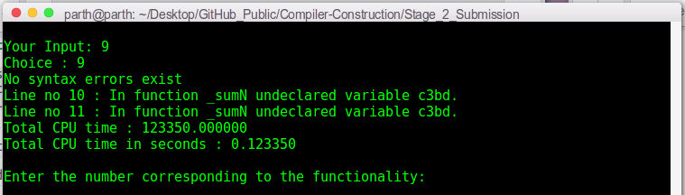

# Stage 2 Submission

This folder contains the complete compiler code for the custom language specified in `Language specifications.pdf`. The file description is as follows:

1. `Semantic_Rules_AST_Creation.pdf`: It contains the semantic rules used for creation of Abstract Syntax Tree (AST) from parse tree.
2. `coding details (stage2).docx`: It contains the details regarding the implementation of different modules of the compiler - lexical analyzer, parser, abstract syntax tree generator, semantic analyzer, type checker and assembly-level code generation.
4. `lexer.c`, `lexer.h` and `lexerDef.h`: Code for the lexical analyzer module of the compiler.
5. `hashTable.c`, `hashTable.h` and `hashTableDef.h`: Implements a hash-table (that is used by the lexical analyzer module).
6. `stack.c`, `stack.h` and `stackDef.h`: Implements a stack (that is used by the parser module).
7. `NaryTree.c`, `NaryTree.h` and `NaryTreeDef.h`: Implements a N-ary tree (that can be used to represent the parse tree, in case the input source code is syntactically correct).
8. `parser.c`, `parser.h` and `parserDef.h`: Code for the parser (predictive parser) module of the compiler.
9. `ast.c`, `ast.h` and `astDef.h`: Code for the AST generator module of the compiler.
10. `typeChecker.c` and `typeChecker.h`: Code for the semantic analyzer and type checker modules of the compiler.

`driver.c` contains driver code that integrates all the above compiler functionalities. Run the following commands in the terminal to run a particular test-case (let's say `testcase1.txt`):
```sh
make
./stage2exe test_cases/testcase1.txt output.txt
```
where `output.txt` stores the parse tree (generated by option `2`, as specified below)

The driver presents the following options (preferably, to be run sequentially):
  * `1`: Prints list of tokens generated by the lexer to console.
  * `2`: Prints to console whether the the input source code is syntactically correct or not, and prints the parse tree to `output.txt` in case input source code is syntactically correct.
  * `3`: Prints the abstract syntax tree (AST) to console.
  * `4`: Prints compression ratio between AST and parse tree to console.
  * `5`: Prints the symbol table to console.
  * `6`: Prints the global symbol table to console.
  * `7`: Prints the function symbol table to console.
  * `8`: Prints the records symbol table to console.
  * `9`: Prints syntax and semantic errors to console (if any).
  * `0`: Exit the interface.

The following is a screenshot of the terminal upon running the above commands:



Option 1:



Option 2:



Option 3:



Option 4:



Option 5:



Option 6:



Option 7:



Option 8:



Option 9:



